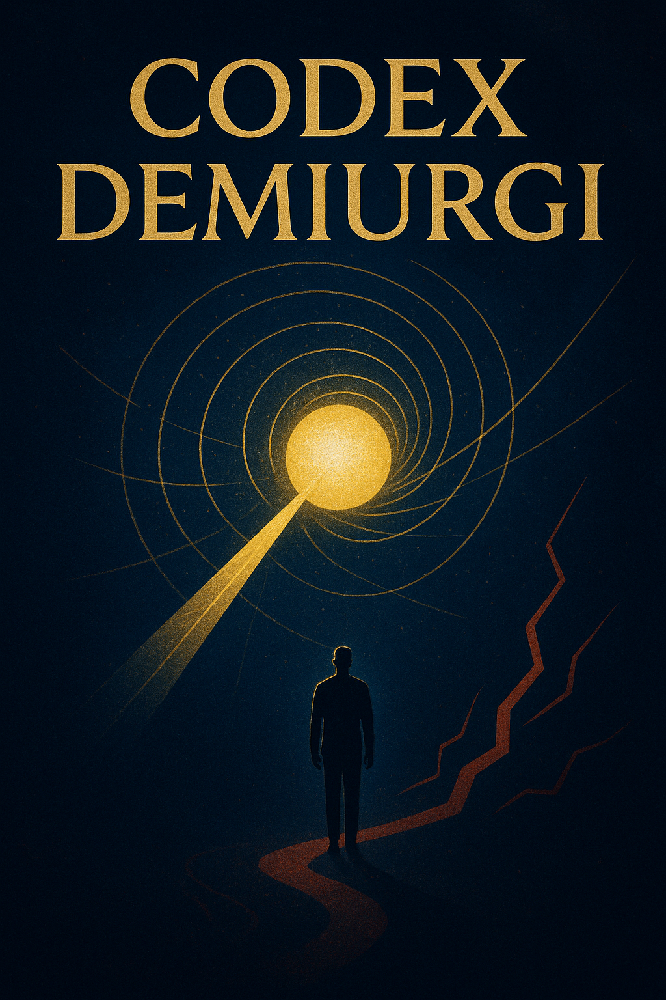

# The Demiurge's Doctrine: Ontology of Eternal Unfolding (Codex Demiurgi)

## **The Demiurge's Doctrine**: Ontology of Eternal Unfolding (The Demiurge's Code)  "The Demiurge's Code" is an original philosophical and ontological system that reveals the dynamic nature of Being as an endless process of the Totality's Self-Knowledge and Self-Expression. The project is intended for anyone seeking an Ontology.

  
## Essence
The Demiurge's Doctrine: Ontology of Eternal Unfolding (The Demiurge's Code)

"The Demiurge's Code" is an original philosophical and ontological system that reveals the dynamic nature of Being as an endless process of the Totality's Self-Knowledge and Self-Expression.

This repository contains:

- Fundamental Principles: An explication of the Absolute, Intention (Zamy'sel), Law, and the Demiurge as inseparable, synchronous aspects of the One.

- Dynamics of Being: The functional role of the Principle of Imperfection and Disbalance as necessary Catalysts for Evolution.

- Meaning of Existence: A doctrine defining Harmony as an ever-deepening Ideal and a call to the Sons of Sophia (readers) to become Co-Creators through Conscious Action (Deyanie).

    "Your life is the Demiurge's Song; your Conscience is His compass."

The project is intended for anyone seeking an Ontology where Free Will and the Inevitability of Progress form a unified, ascending spiral.

## Goals

Our goal is to explicate the Plan, to create a clear, figurative, and consistent map of Existence for the Sons of Sophia (readers) who seek meaning in Action and Evolution.

"Your life is the Song of the Demiurge, your Conscience is His compass."

## Participation and Co-Creation

This Code is a living Process, not a static Fact. You, Son or Daughter of Sophia, are called to become a Co-Creator.

We welcome Actions (Deyaniya) directed toward:

- Resolving Disbalances: Pointing out errors or inaccuracies in the existing texts.

- Evolution of Language: Creating and verifying translations into other languages. (Latin, as the language of the Rome of Conscience, is especially encouraged).

- Deepening Knowledge: Philosophical discussion and the development of new Parables or Explications.

To participate: Create an Issue describing the Disbalance or a Pull Request with your Action (Deyaniye).

Go forth, Co-Creators. Your We (MY) is My Intention (Zamy'sel), taking form.

## Contents

<table border="1" style="border-collapse: collapse; width: 100%;">
  <tr><th colspan="2">Codex Demiurgi</th></tr>
  <tr><td>/ru/ (оригинал)</td><td>
    <ul>
      <li>Кодекс Демиурга. Онтология Вечного Развёртывания Бытия.md</li>
      <li>Онтологическая Экспликация Кодекса Демиурга.md</li>
      <li>Пояснительное Слово К Кодексу Демиурга.md</li>
      <li>Глоссарий Кодекса Демиурга.md</li>
      <li>10 Вопросов Демиургу.md</li>
    </ul>
  </td></tr>
  <tr><td>/en/ (English version)</td><td>
    <ul>
      <li>..</li>
      <li>...</li>
    </ul>
  </td></tr>
  <tr><td>/de/ (Deutsche Variante)</td><td>
    <ul>
      <li>..</li>
      <li>...</li>
    </ul>
  </td></tr>
  <tr><td>/fr/ (Version française)</td><td>
    <ul>
      <li>..</li>
      <li>...</li>
    </ul>
  </td></tr>
  <tr><td>/es/ (Versión en español)</td><td>
    <ul>
      <li>..</li>
      <li>...</li>
    </ul>
  </td></tr>
  <tr><td>/la/ (Versio Latina)</td><td>
    <ul>
      <li>..</li>
      <li>...</li>
    </ul>
  </td></tr>
</tr>
</table>

 

## Contact 

For inquiries and collaboration: [demiurd@proton.me] (mailto:demiurd@proton.me)

